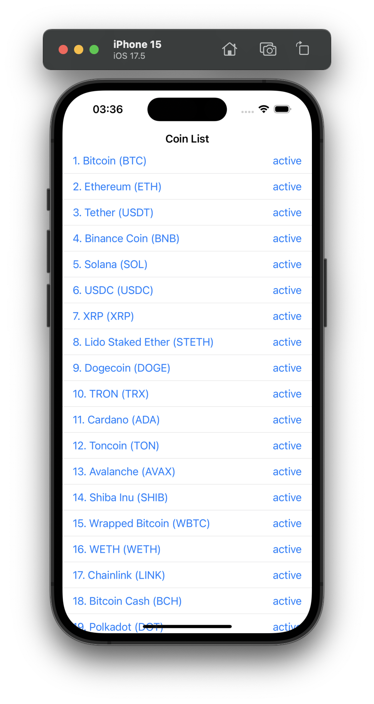
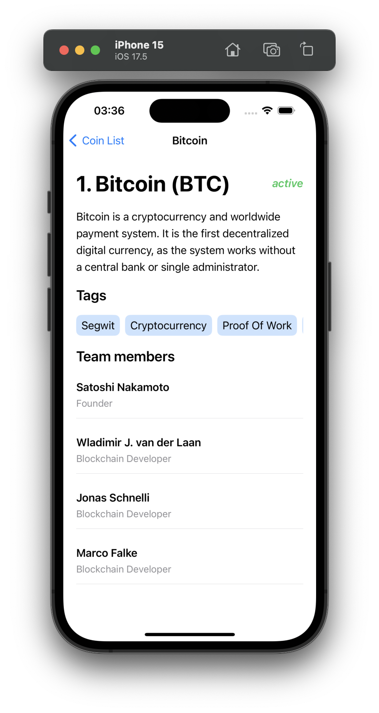

# CryptoApp.KMP

CryptoApp.KMP is a Kotlin Multiplatform project that demonstrates how to fetch and display cryptocurrency data across multiple platforms (Android, iOS, etc.) using a shared codebase.

## Project Summary

This project focuses on utilizing Kotlin Multiplatform capabilities to build a cryptocurrency tracking app with a shared code module. The app fetches and displays the latest cryptocurrency data using the [CoinPaprika API](https://api.coinpaprika.com/) while maintaining platform-specific UI implementations.

## Features

- Fetch cryptocurrency market data from CoinPaprika API.
- Display a list of popular cryptocurrencies with their market information.
- Cross-platform development with shared business logic for Android and iOS.
- MVVM architecture with Kotlin Multiplatform.
- Kotlin Coroutines and Flow for asynchronous operations.
- Uses Ktor for network operations.

## Technology Used

- **Kotlin Multiplatform**: Enables sharing code between Android, iOS, and other platforms.
- **Ktor**: For making network requests to fetch cryptocurrency data.
- **Coroutines and Flow**: For managing asynchronous programming.
- **Jetpack Compose (Android)**: To build modern and declarative UI on Android.
- **SwiftUI (iOS)**: To create a native UI for iOS.

## Screenshots

| iOS List Screen                          | iOS Detail Screen                             |
|------------------------------------------|-----------------------------------------------|
|  |  |

## How It Works

1. **Fetch Data**: The app makes API calls to CoinPaprika to fetch the latest market data.
2. **Display Data**: The fetched data is processed and displayed in a user-friendly way on both Android and iOS.

## Contributing

Contributions are welcome! Please fork this repository and submit a pull request for any improvements.

## License

This project is licensed under the MIT License - see the [LICENSE](LICENSE) file for details.
